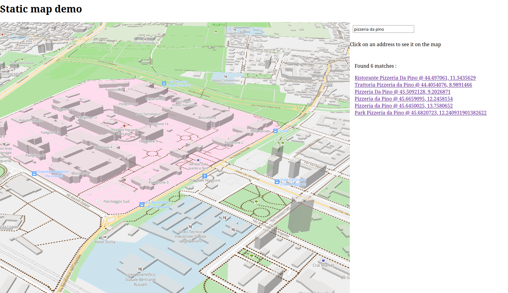

# Static OSM indexer

__[Result demo](https://jacopofarina.eu/experiments/italy_static_map/)__

__[Technical article](https://jacopofarina.eu/posts/static-maps-part-3-text-search/)__

__NOTE__ this project is not production ready at all, maybe never will, but may be useful nonetheless.



This is a collection of scripts that can process data extracts from OpenStreetMap (PBF files) allowing the creation of __static sites__ (that is, a bunch of file hosted without any backend processing) to do a few useful operations:

* display an interactive map (zoom, pan, scroll) based on vector tiles
* locate addresses and places by name
* TODO: nearest neighbor
* TODO: routing (road network can be extracted, but it's not reasonably usable by the frontend)

## Installation

Activate the virtual environment and then:

```pip install static_osm_indexer```

(Or clone this repo and use `make install`)


this will make a set of CLI utilities, all prefixed with `soi_`, available. The library can also be used programmatically.

## Generate a map, single step

This command will generate a fully static map from a PBF extract

```soi_generate_full_map italy-latest.osm.pbf 3.8,36.2,20.2,47.8 test_italy_all```

it needs the name of the folder where to store it and the bounding box.

Use `--help` to see all the options and their usage

Use the `--publish-address` to specify the URL of your map, including protocol and port. By default is `http://127.0.0.1:9000`, be aware that mapbox needs absolute addresses, so it must match the protocol, host and port of your deployment. If missing, can be trivially changed afterwards on the generated files.

## Extract named locations

Run `soi_list_named_locations`, this will generate a file in which every line is a JSON with a `name` field and `lat`, `lon` coordinates (as EPSG:4326).

By default it will extract the `name` tag which generally corresponds to the local name, but you can add specific locales, for example with `--tags 'name,name:it'` you will get local names and Italian names when available. Duplicates are ignored.

## Index named locations

Once you have a file with the list of locations you need to index it using `soi_index_location_names`. This command requires an output folder for the output, and will rearrange the large location names file into smaller files quicker to retrieve on the fly. In this folder a file called `index_metadata.json` contains the metadata needed by the frontend to use the index.

The default config is fine for most cases, but there are two improvements you may want to look into:

* `--stopwords` allows you to ignore words that are very common in addresses, for example the word for *street* in your language. Using it you can create a more balanced index.

* `--token_length` is the amount of characters to be retrieved before fetching a file. By default 3, if you are processing Chinese or Japanese you should set it to 1 given the different statistical distribution of ideograms.

## Extract road network

Use `soi_extract_road_network` to extract the road network graph into a SQLLite database. Use `--help` for further instructions, it has flags to filter for the walking, bicycle and car network. The `--collapse-distance` flag allows to aggregate nodes that are close together to greatly reduce the complexity of the output.

## Convert road network to geoJSON

The `soi_road_network_to_geojson` command can produce a geoJSON representation of a road network. It will generate a file with the edges and another with only the nodes, for inspection. Notice that unless the area is very small or you used the `--collapse-distance` flag these files are going to be quite large.

# Licensing anc crediting

This project is under MIT license. Using the data from OSM is fine including commercial projects, but [there are some rules](https://www.openstreetmap.org/copyright) and you __must__ credit OpenStreetMap.